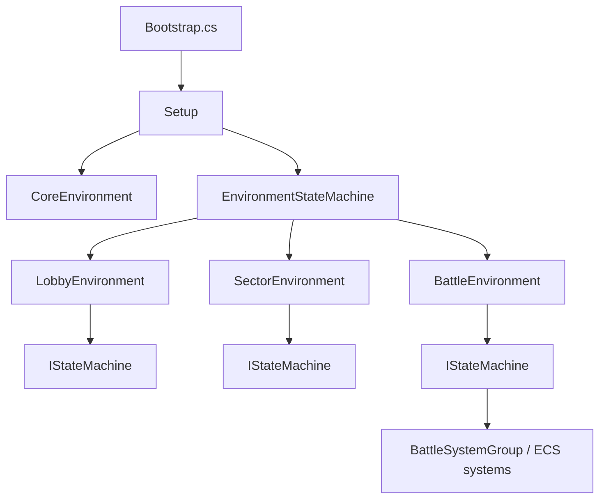

# AutoBattler Local Agent Wiki

This wiki is a compact map for future agents working on AutoBattler. It is based on the current repository layout and source code, not external docs.

## Project Snapshot

- Engine: Unity `6000.4.0f1`, see `ProjectSettings/ProjectVersion.txt`.
- Language/runtime: C# with Unity GameObject UI plus Unity Entities/ECS for battle simulation.
- Namespace used by project code: mostly `vikwhite`; config data uses `vikwhite.Data`; ECS helpers use `vikwhite.ECS`.
- Entry point: `Assets/Scripts/Bootstrap.cs`.
- Main scene list: `Assets/Scenes/Main.unity`, `Tavern.unity`, `Sector1.unity`, `Battle.unity`, plus ECS helper scenes in `Assets/Scenes/ECS`.
- Main code root: `Assets/Scripts/Modules`.
- Main runtime assets loaded by code: `Assets/Resources`.
- No project-owned automated test suite was found; validation usually means Unity compile/play-mode smoke checks.

## Reading Order

1. [architecture.md](architecture.md) explains boot, DI, environments, windows, configs, events, profile data, and battle ECS.
2. [module-map.md](module-map.md) lists the core/gameplay modules and where to look.
3. [module-cookbook.md](module-cookbook.md) gives recipes for common changes.
4. [operations.md](operations.md) covers local commands, generated files, packages, and validation.

## Top-Level Flow

`Bootstrap` injects `ConfigsLoader`, registers the three environments (`Lobby`, `Sector`, `Battle`), and starts in `Lobby`.

## High-Signal Files

- `Assets/Scripts/Bootstrap.cs`: startup composition.
- `Assets/Scripts/Modules/Core/EnvironmentModule/Scripts/Setup.cs`: creates core environment, registers configs, adds environments.
- `Assets/Scripts/Modules/Core/DIModule/Scripts/DiContainer.cs`: custom constructor-injection container.
- `Assets/Scripts/Modules/Core/WindowModule/Sctipts/WindowPresenter.cs`: presenter pattern for UI windows.
- `Assets/Scripts/Modules/Core/ConfigModule/Scripts/ConfigsLoader.cs`: ScriptableObject config gateway backed by Google Sheets loading in editor.
- `Assets/Scripts/Modules/Gameplay/LobbyModule/Scripts/LobbyEnvironment.cs`: lobby environment composition.
- `Assets/Scripts/Modules/Gameplay/SectorModule/Scripts/SectorEnvironment.cs`: sector map environment composition.
- `Assets/Scripts/Modules/Gameplay/BattleModule/Scripts/BattleEnvironment.cs`: battle environment composition.
- `Assets/Scripts/Modules/Gameplay/BattleModule/Scripts/Groups/Groups.cs`: battle ECS system group ordering.
- `Assets/Scripts/Modules/Gameplay/ProfileModule/Scripts/ProfileService.cs`: persistent player profile at `Application.persistentDataPath/Profile.json`.

## Repo Habits

- Module folders are assembly-definition based. Add code to the closest module before creating a new assembly.
- UI prefabs are loaded via `Resources.Load<GameObject>` paths returned by `AssetName` in presenters/factories.
- Reactive UI uses UniRx `ReactiveProperty` and binding helpers in `View`.
- Profile mutation is event-driven: services dispatch events, profile handlers persist the corresponding fields.
- Battle logic is mostly data-oriented ECS; UI and meta progression remain normal C# services/windows.

