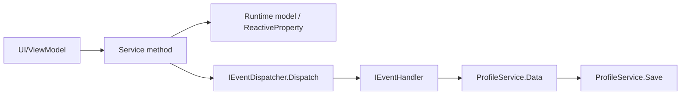

# Architecture

## Startup And Environments

`Assets/Scripts/Bootstrap.cs` is a small MonoBehaviour entry point. In `Awake` it creates `Setup`, injects the serialized `ConfigsLoader`, registers environments by `EnvironmentType`, and starts `EnvironmentType.Lobby`.

`Setup` does three things:

- Loads `CoreEnvironment`.
- Resolves `IEnvironmentStateFactory` and `IEnvironmentStateMachine` from the custom DI container.
- Registers each gameplay environment as an `IEnvironmentState<T>`.

Environment switching is centralized in `EnvironmentStateMachine.SwitchState(EnvironmentType)`. It closes all windows, exits the current environment, resolves the target environment state, and enters it.

Main environments:

- `CoreEnvironment`: asset loading, entity module, event dispatcher, camera, MVVM, windows, environment state factory, location provider.
- `LobbyEnvironment`: loads `Tavern` additively, initializes profile/resources/characters/sector/events, opens lobby state.
- `SectorEnvironment`: loads the current sector scene from `ISectorService.CurrentSector`, initializes sector traversal, opens sector state.
- `BattleEnvironment`: loads `Battle` additively, initializes battle dependencies and switches into squad setup.

## Custom DI

DI lives in `Assets/Scripts/Modules/Core/DIModule/Scripts`.

- `DI.Create()` creates a `DiContainer` and attaches it to the shared `DiAggregator`.
- Each `Environment` owns a `DiContainer`; `Dispose()` clears that container's registrations.
- The aggregator searches containers in insertion order. If the current container cannot resolve a constructor dependency, it may be resolved from another container.
- `Register<TInterface, TImplementation>()` creates a singleton per interface key on first resolve.
- `Register<TImplementation>()` creates instances for concrete resolves and caches implementation singletons when resolving `IEnumerable<T>`.
- `IEnumerable<T>` constructor arguments collect all implementations registered across containers. This is how `EventDispatcher` receives all `IEventHandler`s.
- Constructors are selected by highest parameter count. Avoid ambiguous constructors.
- `IUpdatable` services registered as singleton keys are updated from `DiAggregator.Update()` through `DiSceneContext`.

Practical rule: add new services to the relevant `*ModuleDependency` and keep constructor dependencies registered in the same environment or core environment.

## State Machines

Local state machines use `IStateMachine<TStateRoot>` from `Core/StateMachineModule`.

- Each gameplay module defines a marker state interface such as `ILobbyState`, `ISectorState`, or `IBattleState`.
- The module dependency registers `IStateMachine<T>`, `IStateFactory<T>`, and each concrete state interface.
- Switching calls `Exit()` on the previous state, resolves the next state via DI, then calls `Enter()`.

Environment state is separate and keyed by `EnvironmentType`.

## UI And MVVM

UI lives around `WindowPresenter`, `WindowView`, `ViewModel`, and `View`.

- A window presenter declares `public override string AssetName => "UI/Prefabs/..."`.
- `WindowViewFactory` loads that prefab through `ResourceAssetLoader`, so the path is relative to `Assets/Resources`.
- `WindowPresenter.ShowWindow(viewModel)` creates or reuses the view, initializes the view model, subscribes to `OnClose`, and asks `WindowManager` to show it.
- `WindowManager.CloseAllWindows()` is called on environment switches.
- `View<TView, TViewModel>` has helpers for UniRx field binding and button click binding; `Release()` disposes bindings and the view model.
- Hierarchy MonoBehaviours are named `*Hierarchy` and expose serialized UI references for the corresponding `*View`.

Common UI asset paths include:

- `UI/Prefabs/LobbyWindow/LobbyWindow`
- `UI/Prefabs/SectorWindow/SectorWindow`
- `UI/Prefabs/BattleWindow/BattleWindow`
- `UI/Prefabs/SquadWindow/SquadWindow`
- `UI/Prefabs/CharacterWindow/...`
- `UI/Prefabs/Elements/...`

## Configs

Configs are exposed by `IConfigs` and implemented by `ConfigsLoader`, a Sirenix `SerializedScriptableObject`.

- Runtime code receives `IConfigs` from `Setup.Configs(Configs)`.
- The `Load` Odin button exists only in editor and loads Google Sheets tabs through `Config<T, I>.Load`.
- Sheet names are derived from private field names with `CapitalizeFirstLetter()`.
- `Config<T, I>` parses public fields by matching column names to field names.
- Supported primitive parsing includes string, int, float, bool, uint hash, enum, and `int2` in `x:y` format.
- `ICustomJsonParser` lets config rows do custom parsing and resource loading.
- Some data objects load assets from `Resources`, for example character images/prefabs and skill icons.

Treat the serialized `ConfigsLoader` asset under `Assets/Resources/Configs` as the runtime config snapshot.

## Events And Profile Persistence

The core event system is type-based:

- `IEventDispatcher.Dispatch(object eventData)` looks up handlers by exact event runtime type.
- Handlers inherit `EventHandler<TEvent>`.
- Register handlers as `IEventHandler` in a module dependency.
- `EventDispatcher` groups handlers once in its constructor, so register all needed handlers before first resolve.

Profile data:

- `ProfileService.Load()` resets defaults, then reads `Application.persistentDataPath/Profile.json` if present.
- `ProfileService.Save()` writes JSON through `JsonUtility`.
- `ProfileModuleDependency` registers profile handlers for resources, characters, quests, and sector location.
- Runtime services dispatch events such as `ChangeResourceEvent`; profile handlers update `ProfileData`.

Important service flow:

## Battle ECS

Battle simulation uses Unity Entities and project helpers under `Core/ECSModule` and `Gameplay/BattleModule`.

`BattleSystemGroup` is disabled by default and enabled from `BattleSquadState`. Its order is:

1. `TimeSystemGroup`
2. `CleanupSystemGroup`
3. `InitializeSystemGroup`
4. `SetupSystemGroup`
5. `MovementSystemGroup`
6. `CollisionSystemGroup`
7. `GameplaySystemGroup`
8. `DeadSystemGroup`
9. `StatusesSystemGroup`
10. `EffectsSystemGroup`
11. `SkillTriggerSystemGroup`
12. `CreateSystemGroup`
13. `AnimationSystemGroup`
14. `EventSystemGroup`
15. `FrameCleanupSystemGroup`

When time is paused, `BattleSystemGroup.AllowSetupWhilePaused` lets setup/initialization/create/event cleanup groups keep running during squad setup.

Useful helpers:

- `ECSWorld.SetEnabled<T>(bool)`: enable/disable unmanaged `ISystem`.
- `ECSWorld.SetManagedEnabled<T>(bool)`: enable/disable managed system groups.
- `ECSWorld.CreateEntity<T>(T component)`: create a scene-scoped entity with `SceneEntity`.
- `BakerExtensions.RegisterPrefab(...)`: adds prefabs to `PrefabRegistry` buffer for ECS spawning.

Battle state flow:

- `BattleSquadState`: clears squad, initializes location/enemies, pauses time, opens squad window.
- `BattleStartState`: creates `InitializeSquad`, enables end-battle system, unpauses time, opens battle window.
- `BattleVictoryState` / `BattleDefeatState`: show result windows.
- `BattleEndState`: cleanup on environment exit.

## Naming And Path Notes

Some folder names contain existing typos: `Sctipts`, `Conponents`, `Invenotry`, `TweenHendler`. Do not rename these casually; Unity references and asmdefs may depend on current paths.

